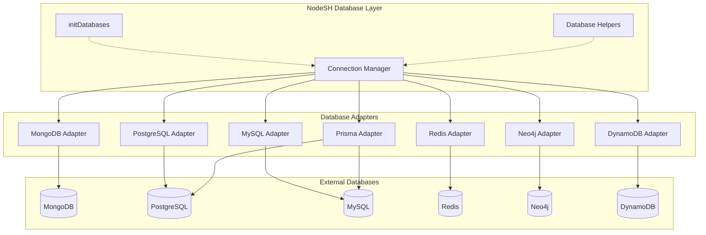
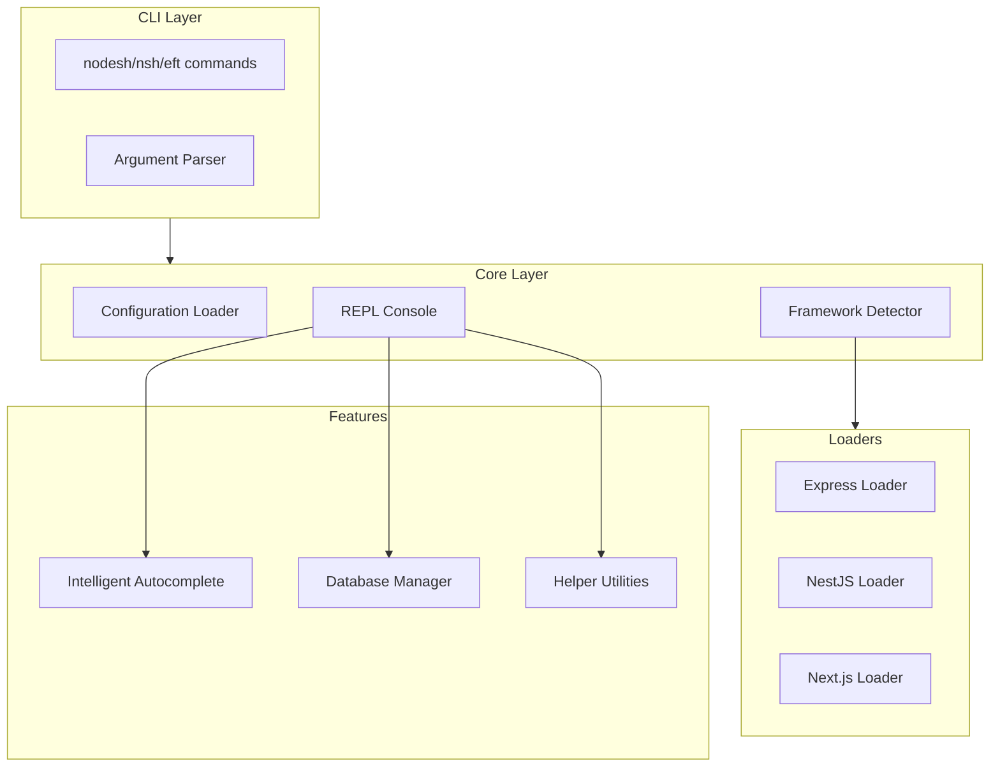

# NodeSH Documentation

> An interactive shell for Node.js applications

[](https://www.npmjs.com/package/@eftech93/nodesh)
[](https://opensource.org/licenses/MIT)
[](https://nodejs.org/)
[](https://www.typescriptlang.org/)

## What is NodeSH?

NodeSH provides an interactive REPL environment with intelligent autocompletion, automatic application loading, and deep object introspection capabilities.

## Key Features

- 🚀 **Framework Agnostic** - Works with Express, NestJS, and Next.js
- 🔄 **Auto-Detection** - Automatically detects your framework and configuration
- 📦 **Auto-Loading** - Automatically loads models, services, and configuration files
- 🎯 **Intelligent Autocompletion** - Deep tab completion for object properties and methods
- 🔍 **Object Introspection** - Built-in helpers to explore objects (`info()`, `methods()`, `props()`, `type()`)
- 🌐 **API Client** - Built-in HTTP client for testing external and local APIs
- 📬 **Queue Management** - Full BullMQ/Bull queue control (pause, resume, retry, clean, schedule)
- 🔄 **Hot Reload** - Reload your app without restarting the shell
- 🎨 **Syntax Highlighting** - Colorized output for better readability
- 📜 **Command History** - Persistent history across sessions
- 🔷 **Full TypeScript Support** - Written in TypeScript with full type definitions
- 🗄️ **Multi-Database Support** - MongoDB, PostgreSQL, MySQL, Redis, Prisma, Neo4j, DynamoDB
- 🧪 **Testing Helpers** - Built-in API testing, seeding, and timing utilities

## Quick Start

### Installation

```bash
# Global install (recommended)
npm install -g @eftech93/nodesh

# Or local install
npm install --save-dev @eftech93/nodesh
```

### Launch the Shell

```bash
# Navigate to your project
cd my-project

# Start the shell (auto-detects framework)
nodesh --yes

# Or use shorter aliases
nsh --yes
eft --yes
```

### Start Coding

```javascript
// Query your database
node> await User.find({ isActive: true })

// Use your services
node> await userService.create({ email: 'test@example.com' })

// Check application state
node> await cacheService.getStats()

// Reload after code changes
node> .reload
```

## Documentation Sections

- **[Getting Started](/guides/getting-started)** - Installation and basic usage
- **[Configuration](/guides/configuration)** - Configure NodeSH for your project
- **[Features](/guides/features)** - Detailed feature documentation
- **[API Reference](/api/)** - Complete API documentation
- **[Examples](/examples/)** - Working examples for different frameworks
- **[Test Reports](/test-report)** - Latest test results and coverage

## Supported Frameworks

| Framework | Detection | Entry Point |
|-----------|-----------|-------------|
| Express | `express` in dependencies | `src/app.js` |
| NestJS | `@nestjs/core` in dependencies | `src/main.ts` |
| Next.js | `next` in dependencies | `src/app/` or `pages/` |

## Supported Databases

NodeSH includes built-in support for 7+ databases:

| Database | Type | Adapter | Environment Variable |
|----------|------|---------|---------------------|
| 🍃 MongoDB | Document | mongoose | `MONGODB_URI` |
| 🐘 PostgreSQL | Relational | pg | `DATABASE_URL` or `PGHOST` |
| 🐬 MySQL | Relational | mysql2 | `DATABASE_URL` or `MYSQL_HOST` |
| ⚡ Redis | Key-Value | ioredis | `REDIS_URL` or `REDIS_HOST` |
| 📊 Prisma | Universal | @prisma/client | `DATABASE_URL` |
| 🕸️ Neo4j | Graph | neo4j-driver | `NEO4J_URI` |
| 📦 DynamoDB | NoSQL | aws-sdk | `AWS_REGION` |

### Database Architecture



### Quick Database Connection

```javascript
const { initDatabases, getConnectionManager } = require('@eftech93/nodesh');

// Auto-detect and connect all configured databases
const { manager, helpers } = await initDatabases();

// Access any connection
const mongo = manager.get('mongodb');
const postgres = manager.get('postgresql');
const redis = manager.get('redis');

// Get stats for all databases
const stats = await helpers.getDBStats();
```

See the [Database Guide](guides/database.md) for detailed configuration and usage.

## Architecture Overview



## License

MIT © [EFTECH93](https://github.com/eftech93)
